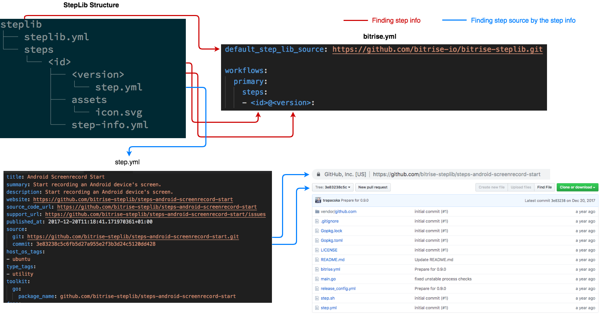

# StepLib specification

StepLib is the central place where we collect each step descriptor files for all step versions, icon and deprecation info.

## Structure

```bash
steplib
├── steplib.yml
└── steps
    └── <id>
        ├── <version>
        │   └── step.yml
        ├── assets
        │   └── icon.svg
        └── step-info.yml
```

Beside of `steplib.yml` there is a steps folder in which each directory is a step and its name is the step ID. Dirs within the step's dir are for versioning with a `step.yml` in them. Beside of the version dirs optionally can be an assets dir with an `icon.png` or `icon.svg` file in it. Optionally a `step-info.yml` file can be stored beside of the version dirs with the deprecation info in it.

> ID format: `[a-z];[0-9];-`

> Version format: `X.X.X` - (https://semver.org)

Version is matching with the tag name in the step's repository that created for a release.

## steplib.yml

A sample steplib.yml:
```yaml
---
format_version: 1.0.0
steplib_source: https://github.com/bitrise-io/bitrise-steplib.git
assets_download_base_uri: https://bitrise-steplib-collection.s3.amazonaws.com/steps
download_locations:
  - type: zip
    src: https://bitrise-steplib-collection.s3.amazonaws.com/step-archives/
  - type: git
    src: source/git
```

Fields:

- format_version 
  > Version for the current format, need to change if there is a change in the StepLib's structure.
- steplib_source
  > The actual location of the StepLib.
- assets_download_base_uri
  > The prefix of an url where step assets are stored. For example: `<assets_download_base_uri>/<id>/assets/icon.svg` will point to the step `<id>`'s icon.
- download_locations
  > These are the locations where the step collection data is stored. This can be zip or git type. In case of git the storage will be a git repository. If the type is zip that means that beside of the git source the step data is stored on a 3rd place as well, in this case this is an S3 storage and its url prefix is set for the `src` option. For example: `<download_locations->type:zip->src>/<id>/<version>/step.zip` will point to the zip archive of the step repository's content for the given `<id>` and a given `<version>`. It is important that in this case not the step info from the StepLib will be stored in the archive but the whole step repository's content. 

## step.yml

We store the same step.yml that is in the original step's repository except it is required to inject some details about the release and the step repository.

The injected fields:
```yaml
published_at: 2019-03-14T14:58:53.356958732Z
source:
  git: https://github.com/bitrise-steplib/bitrise-step-android-lint.git
  commit: 960fc806a066bae5f8a38fd5e076f80dcc87b181
```

Our tools relying on both version(git tag) and git commit as well because in the share process the tools are looking for the tag by name and gets the commit hash for the tag, this is why it is important to not to move any tag on a step repository. In those cases the commit hash will be different than the original submitted in the release process.

Fields:
 - published_at
   > When the release process is finished.
 - source
   > `git`: the repository url for the step; `commit`: the hash for the given version(tag)


## Icon

The step's icon should match with the following criterias:
- NOT transparent background color
- Size: 256 * 256 px
- Margin: 60 px
- Format: SVG
- Name: icon
- Location: `steps/<id>/assets/icon.svg`

## step-info.yml

A sample `step-info.yml` file:
```yaml
removal_date: "2019-02-29"
deprecate_notes: "This step is deprecated, Push Notifications are no longer supported by Parse server."
```

Fields:
- removal_date
  > The date the step will be completely unavailable. Format: YYYY-MM-DD
- deprecate_notes:
  > Some note for the user to know the reason why the step is getting deprecated or to redirect them to an alternative.

The flow of depreacting a step:
1. Add the `step-info.yml` to the step's root dir.
   > After this point the step won't be visible on the Workflow Editor's step selector view and on the integrations page to avoid adding the deprecated step to a new workflow, however it still will work the same way: can be removed from the Workflow Editor, can be added in `bitrise.yml`, and workflows containing this step still will be able to run as previously.
2. After the removal date set in `step-info.yml` the step will be removed from the StepLib. This means that if the step is still used somewhere that will stop working. Bitrise CLI will print an error about not finding a step with the given ID.

## Data sources of Bitrise StepLib

- git (https://github.com/bitrise-io/bitrise-steplib)
  > A simple git repository, including all data.
- spec.json (https://bitrise-steplib-collection.s3.amazonaws.com/spec.json)
  > A JSON file generated after each push to master, and uploaded to an S3 storage. Contains all the step infos, asset URLs and basic info about the StepLib. 
- slim-spec.json (https://bitrise-steplib-collection.s3.amazonaws.com/slim-spec.json)
  > This is the same as `spec.json` but not containing all versions infos for all steps. Only latest step versions are stored. 

## Where and how is StepLib used
- Website (slim-spec.json)
  > On the integrations page and in the Workflow Editor.
- Bitrise CLI
  > 

## Sharing new step info

Currently we have a tool called [Stepman](https://github.com/bitrise-io/stepman). (`bitrise share` will call out to `stepman`)

  > ```
  > bitrise share start -c ${MY_STEPLIB_REPO_FORK_GIT_URL}
  > bitrise share create --stepid ${STEP_ID_IN_STEPLIB} --tag ${STEP_GIT_VERION_TAG_TO_SHARE} --git ${STEP_GIT_CLONE_URL}
  > bitrise share finish
  > ```

  Parameters:
  - MY_STEPLIB_REPO_FORK_GIT_URL: you need to fork StepLib first to be able to create a new branch with your modification(added an extra step.yml), this ENV is for this forked StepLib's git url. This is where from the PR will be sent to our StepLib.
  - STEP_ID_IN_STEPLIB: `<id>`
  - STEP_GIT_VERION_TAG_TO_SHARE: `<version>`
  - STEP_GIT_CLONE_URL: step repository git url

 Stepman's release flow:
  - clones freshly the given StepLib fork repo
  - copies the step.yml from the step's repo
  - injects git url, commit hash and published_at timestamp
  - pushes the new step.yml to the fork repo under `steps/<id>/<version>/step.yml` to the `<id>-<version>` branch.

As a last step a PR need to be opened from the `<id>-<version>` branch to the original StepLib repo.

## Using step outside of StepLib

Example bitrise.yml:
```yaml
workflows:
  primary:
    steps:
    - git::<git-url>@<branch>:
    - path::/my/local/path/to/the/step:
```

Other possible sources:
- Git
  > Using `git::` prefix in the step ID will turn the CLI to automatically look for the step source from the given git URL and branch. URL will be the ID and the branch will go to the place of the version.
  > For example: `git::https://github.com/bitrise-io/stepman@master`.
- Path
  > Using `path::` prefix in the step ID will turn the CLI to automatically look for the step source within a directory on your local machine. There no need to use version part and the step ID will be the local path to the step's directory.
  > For example: `path::./mystep`.